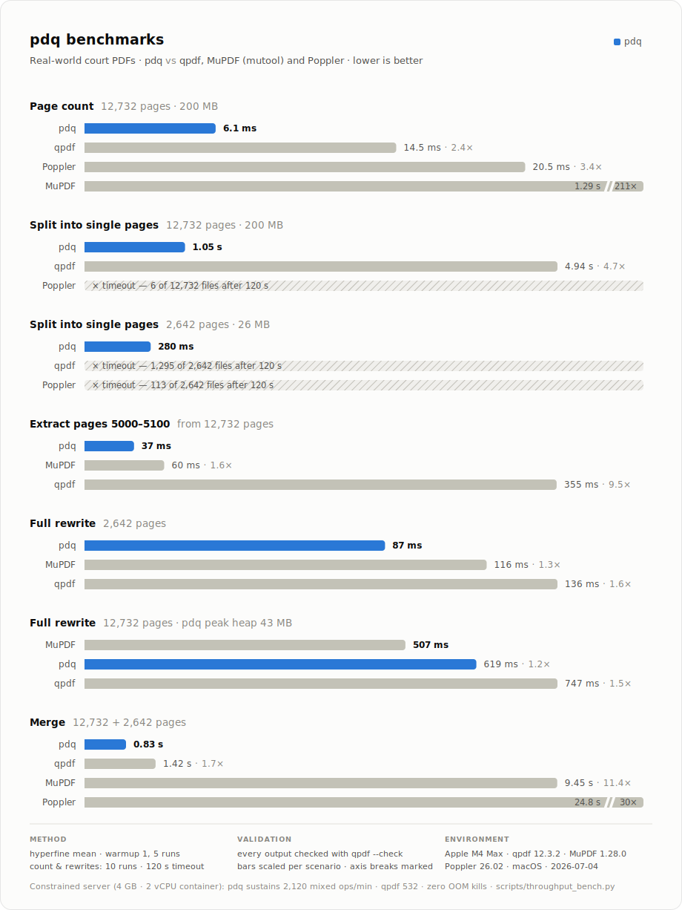

# pdq

Rust-native PDF split and merge MVP.

Runtime constraints:

- does not invoke the `qpdf` binary;
- does not use a subprocess wrapper;
- does not link libqpdf through FFI.

The first implementation uses `lopdf` as a pure-Rust PDF object model and
writer. It focuses on valid split/merge outputs for ordinary, unencrypted PDFs.
Advanced qpdf behavior such as repair, encryption, linearization, forms,
outlines, and full compatibility with unusual historical PDFs is intentionally
out of scope for the current MVP.

## Commands

```sh
cargo test
cargo run --bin pdq -- split input.pdf --out 1-3 out-1.pdf --out 4-z out-2.pdf
cargo run --bin pdq -- split-pages --output 'page-%d.pdf' input.pdf
cargo run --bin pdq -- split-pages --output 'chunk-%d.pdf' --pages-per-file 3 input.pdf
cargo run --bin pdq -- merge --output merged.pdf a.pdf b.pdf
cargo run --bin pdq -- page-count input.pdf
```

`split-pages --pages-per-file N` groups consecutive pages into files of at most
N pages each (`%d` is the 1-based chunk index; the last chunk may contain fewer
pages). The default of 1 writes one page per file.

`page-count` prints the number of pages to stdout. By default it trusts the
root `/Pages` `/Count` — the same semantics as `qpdf --show-npages` — and
automatically falls back to a validated page-tree walk when `/Count` is
missing, malformed, negative, or implausibly large. Pass `--strict` to force
the validated walk, which counts the exact leaf pages `split`/`split-pages`
would resolve and is immune to lying metadata.

Tests may use `qpdf` as a development validator when it is available on `PATH`.
The runtime implementation must remain qpdf-free.

## Render

`pdq render` rasterizes pages to PNG through [hayro](https://github.com/LaurenzV/hayro),
a pure-Rust PDF renderer, so the qpdf-free and FFI-free constraints still hold.
Pages render in parallel and `%d` in the output pattern receives the original,
zero-padded page number. The command lives behind the `render` cargo feature,
which is enabled by default; build with `--no-default-features` for a smaller
split/merge-only binary. Rendering requires Rust 1.92 or newer.

## Benchmarks



Measured 2026-07-04 on two real-world court PDFs: 200 MB / 12,732 pages and
26 MB / 2,642 pages. The files stay outside the repo;
`scripts/make_fixtures.py` synthesizes PII-free replicas with the same
structural pathology (object counts, page-tree shape, shared-resources
pattern, filter zoo) that reproduce these timings within noise.

Wall time is `hyperfine --warmup 1 --runs 5` mean (page count: warmup 2,
10 runs), 120 s timeout. Every completed output was validated by page count
and `qpdf --warning-exit-0 --check`; split scenarios validated first, middle,
and last files. qpdf used `--remove-unreferenced-resources=no` for copy-like
paths where applicable.

| Scenario | pdq | qpdf | MuPDF | Poppler |
| --- | ---: | ---: | ---: | ---: |
| Page count, 12,732p | **6.1 ms** | 14.5 ms | 1.29 s | 20.5 ms |
| Split into single pages, 12,732p | **1.05 s** | 4.94 s | n/a | >120 s (6 files out) |
| Split into single pages, 2,642p | **280 ms** | >120 s (1,295 out) | n/a | >120 s (113 out) |
| Extract pages 5000–5100 | **37 ms** | 355 ms | 60 ms | n/a |
| Full rewrite, 2,642p | **109 ms** | 186 ms | 126 ms | n/a |
| Full rewrite, 12,732p | 636 ms | 965 ms | **603 ms** | n/a |
| Merge 12,732p + 2,642p | **0.83 s** | 1.42 s | 9.45 s | 24.8 s |

The 12,732-page rewrite is a statistical tie with MuPDF (overlapping σ);
every other scenario is a pdq win. To reproduce the timing matrix:

```sh
PDQ_BIG_PDF=/path/to/12732-pages.pdf \
PDQ_SMALL_PDF=/path/to/2642-pages.pdf \
scripts/benchmark.sh
```

The chart is generated by `scripts/gen_benchmark_svg.py` (data at the top of
the script) into `assets/benchmark.svg`.
